# Academic Figure Master

A lightweight Codex/Claude skill for publication-ready academic figures that stay **genuinely editable** in SVG, draw.io, or PowerPoint. Original figures use semantic native objects; pixel-faithful paper reproductions use a dual-layer SVG that separates exact source appearance from convenient text-and-component editing.

   

The current version includes:

- 18 reusable academic-figure primitive sheets;
- 11 pixel-exact, dual-layer reproductions of exact classic-paper figures;
- 6 reproducible curve templates with explicit fidelity labels;
- a machine-readable provenance and reproduction manifest;
- a surveyed catalog of vector models, scientific-figure systems, skills, editors, and asset libraries;
- daily GitHub metadata, stars, activity, license, and discovery refreshes; and
- dependency-free core generation, validation, synchronization, and installation scripts, plus source-operator extraction and source/redraw/pixel-difference QA harnesses.

## Install and invoke

After cloning the private repository:

```bash
python scripts/install_skill.py --target codex
```

The default installation is a symbolic link, so repository updates are immediately available to Codex. Use `--mode copy` for an isolated copy, `--target claude` for Claude, or `--target path --path /absolute/destination` for a custom directory.

Example request:

```text
Use $academic-figure-master to reconstruct this method figure as editable SVG.
Keep every label as text and preserve stable object IDs for later revisions.
Reuse the residual block and uncertainty-band assets where appropriate.
```

## Reusable academic primitives

Every sheet below is native SVG: text stays text, shapes stay shapes, and reusable parts have named groups. Click a preview to open the editable source.

<table>
<tr>
<td width="33%"><a href="assets/primitives/manifold-grid.svg">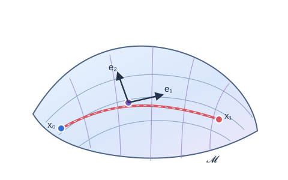</a><br><b>Manifold grid</b><br><sub>surface · coordinates · geodesic · tangent basis</sub></td>
<td width="33%"><a href="assets/primitives/sde-ode-trajectories.svg">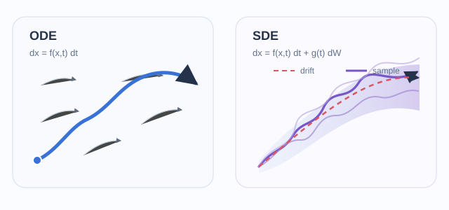</a><br><b>SDE / ODE trajectories</b><br><sub>drift · sample paths · uncertainty</sub></td>
<td width="33%"><a href="assets/primitives/hand-drawn-arrows.svg">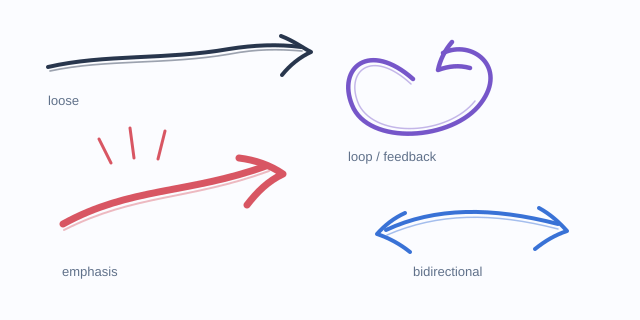</a><br><b>Hand-drawn arrows</b><br><sub>loose · emphasis · feedback · bidirectional</sub></td>
</tr>
<tr>
<td><a href="assets/primitives/diffusion-process.svg">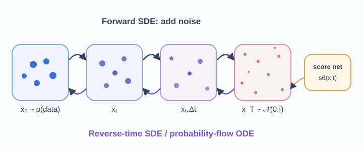</a><br><b>Diffusion process</b><br><sub>forward SDE · reverse flow · score network</sub></td>
<td><a href="assets/primitives/tensor-stack.svg">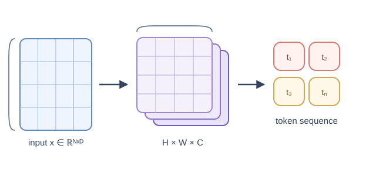</a><br><b>Tensor stack</b><br><sub>matrix · feature maps · token sequence</sub></td>
<td><a href="assets/primitives/neural-modules.svg">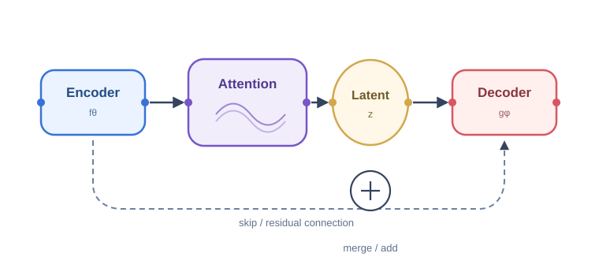</a><br><b>Neural modules</b><br><sub>encoder · attention · latent · decoder · residual</sub></td>
</tr>
<tr>
<td><a href="assets/primitives/attention-heads.svg">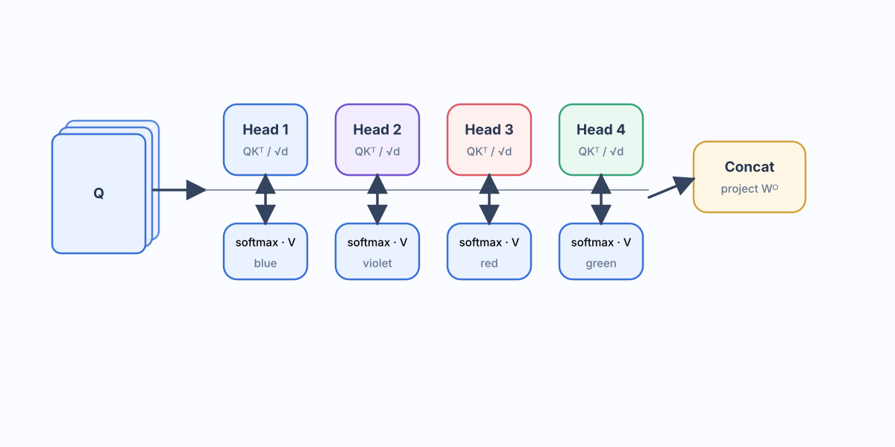</a><br><b>Multi-head attention</b><br><sub>heads · softmax · value projection · concat</sub></td>
<td><a href="assets/primitives/convolution-pyramid.svg">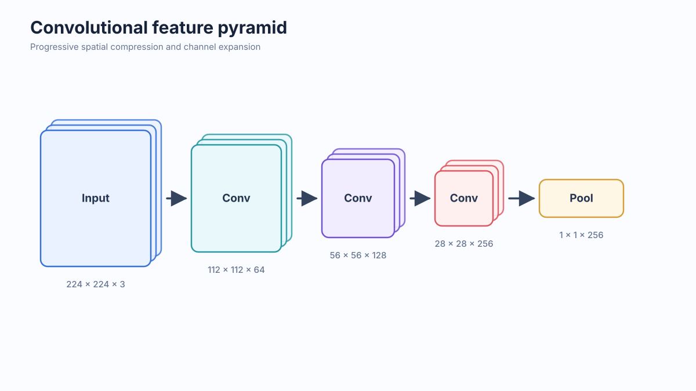</a><br><b>Convolution pyramid</b><br><sub>spatial compression · channel expansion</sub></td>
<td><a href="assets/primitives/graph-message-passing.svg">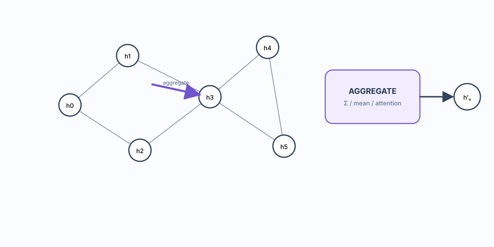</a><br><b>Graph message passing</b><br><sub>neighborhood · aggregate · update</sub></td>
</tr>
<tr>
<td><a href="assets/primitives/causal-dag.svg">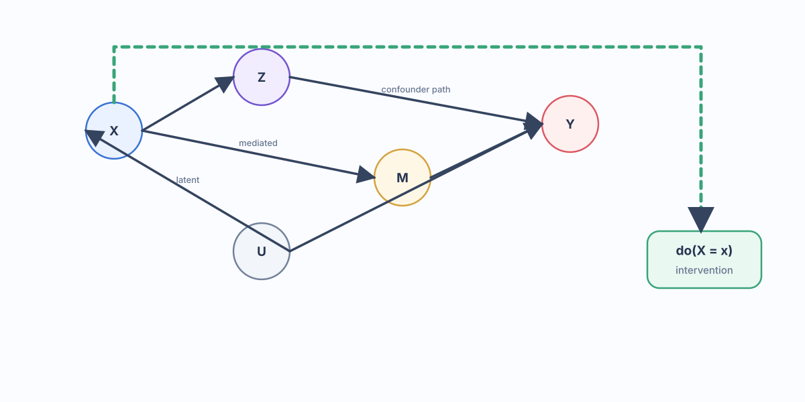</a><br><b>Causal DAG</b><br><sub>confounding · mediation · intervention</sub></td>
<td><a href="assets/primitives/optimization-landscape.svg">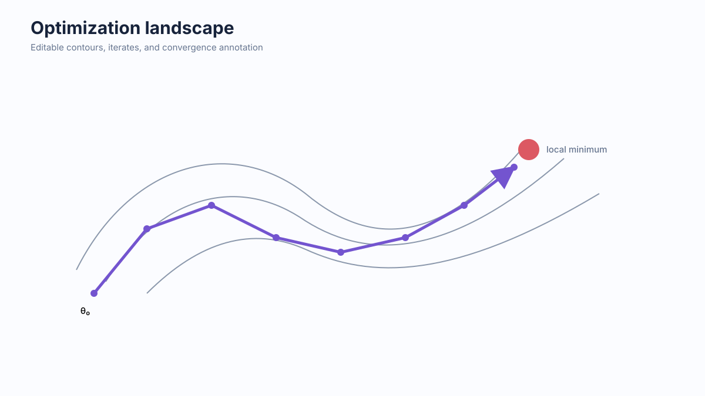</a><br><b>Optimization landscape</b><br><sub>contours · iterates · local minimum</sub></td>
<td><a href="assets/primitives/uncertainty-bands.svg">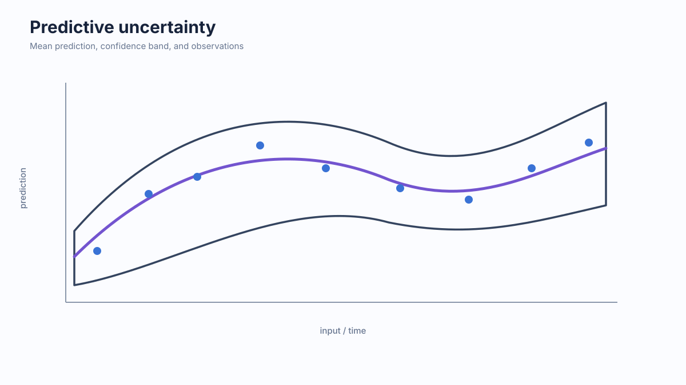</a><br><b>Predictive uncertainty</b><br><sub>mean · confidence band · observations</sub></td>
</tr>
<tr>
<td><a href="assets/primitives/dataset-pipeline.svg">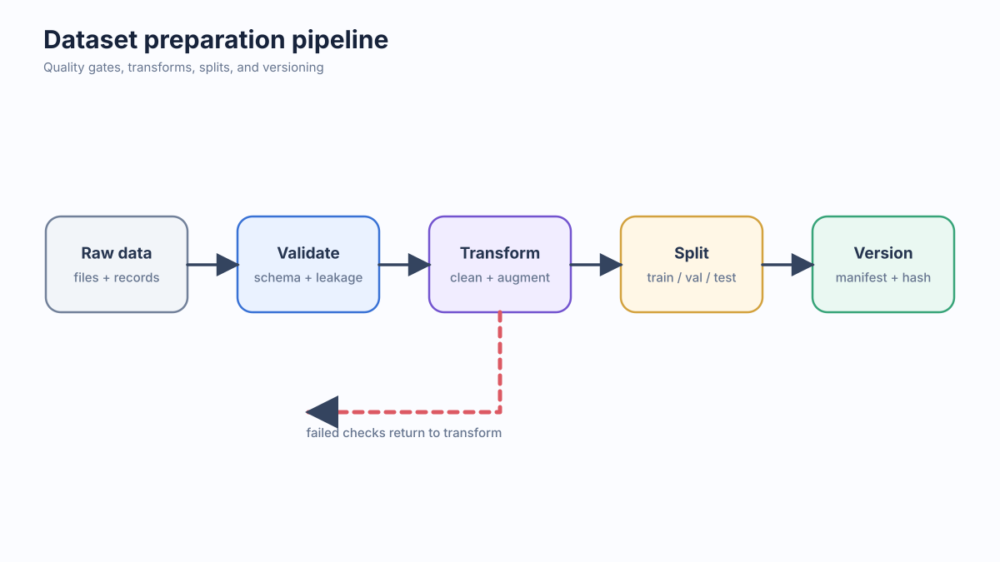</a><br><b>Dataset pipeline</b><br><sub>validate · transform · split · version</sub></td>
<td><a href="assets/primitives/training-loop.svg">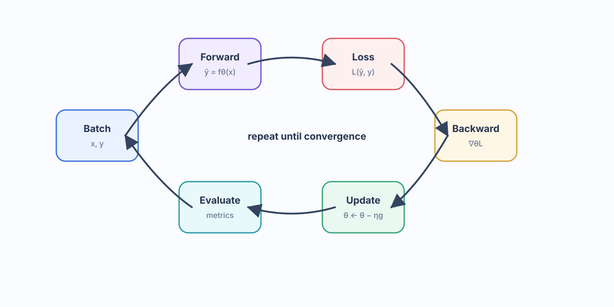</a><br><b>Training loop</b><br><sub>forward · loss · gradient · update · evaluate</sub></td>
<td><a href="assets/primitives/ensemble-voting.svg">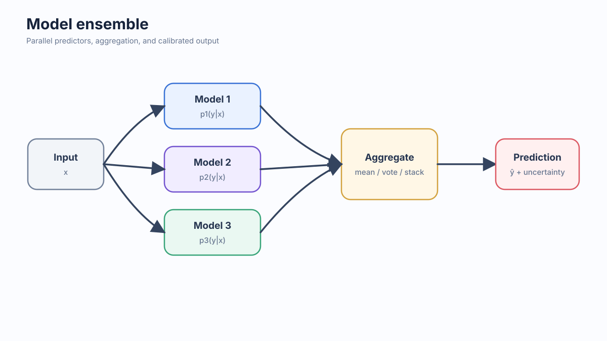</a><br><b>Model ensemble</b><br><sub>parallel models · aggregate · uncertainty</sub></td>
</tr>
<tr>
<td><a href="assets/primitives/bayesian-inference.svg">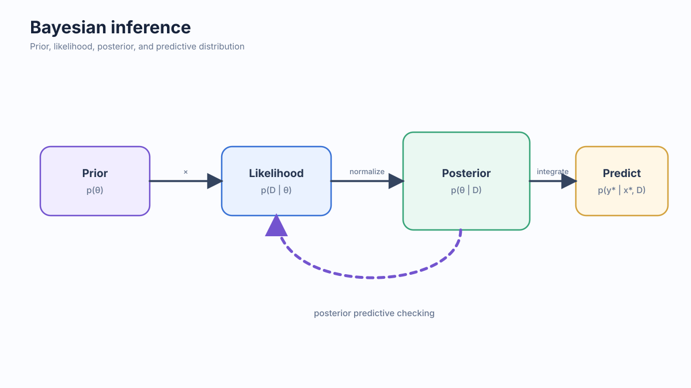</a><br><b>Bayesian inference</b><br><sub>prior · likelihood · posterior · predictive</sub></td>
<td><a href="assets/primitives/multimodal-fusion.svg">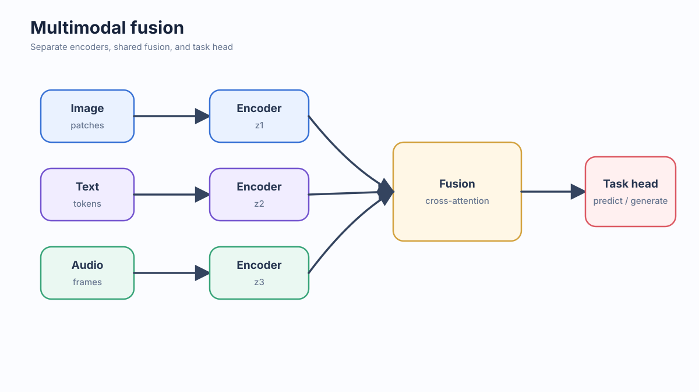</a><br><b>Multimodal fusion</b><br><sub>image · text · audio · cross-attention</sub></td>
<td><a href="assets/primitives/ablation-matrix.svg">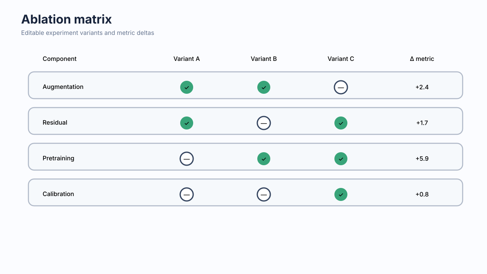</a><br><b>Ablation matrix</b><br><sub>variants · components · metric deltas</sub></td>
</tr>
</table>

## Pixel-exact classic-paper reproductions

Every paper reproduction uses the exact cited figure rather than a modern concept diagram. The default visible layer, `source-vector-operators`, is extracted directly from the source PDF: paths, fills, strokes, glyph outlines, and any source image operators are preserved. A second `semantic-edit-layer` contains named text and components and is hidden by default. This makes the checked-in rendering exact while retaining a practical layer for customization.

Each review plate shows the independent PDF crop, the SVG render, and an edge overlay side by side. Magenta is the paper source, cyan is the SVG, and black is overlap. The source crop is review evidence only and the paper retains its rights. Source glyphs are paths in the visible layer; edit wording in the hidden semantic layer. Transformer, DDPM, and ViT contain 2, 3, and 2 named embedded raster operators respectively because those exact source figures contain bitmap content; the manifest discloses this instead of pretending those regions are vectors.

Current hard-gate results in [`assets/comparisons/qa-report.json`](assets/comparisons/qa-report.json): 11/11 semantic layers are pixel-isolated (`1.0000`), maximum tight-content aspect error is `0.63%`, and the minimum independently rasterized PDF↔SVG match is `83.10%` at a 32-level antialiasing tolerance. Cross-renderer scores are not expected to be 100% because Poppler and Sharp antialias the same operators differently; exact provenance is recorded with a SHA-256 hash of each extracted source-operator layer in [`assets/paper-redraws/pixel-exact-manifest.json`](assets/paper-redraws/pixel-exact-manifest.json).

<a href="assets/paper-redraws/lenet-5.svg">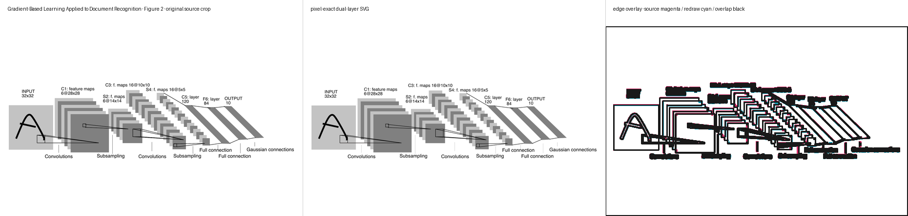</a>

LeCun et al. (1998), Figure 2 · [paper](https://leon.bottou.org/publications/pdf/ieee-1998.pdf)

<a href="assets/paper-redraws/alexnet.svg">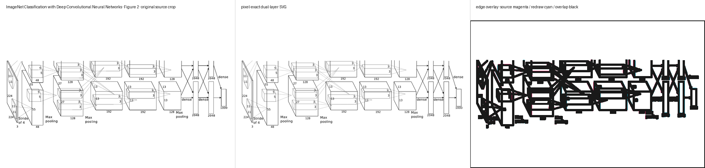</a>

Krizhevsky et al. (2012), Figure 2 · [paper](https://papers.nips.cc/paper_files/paper/2012/file/c399862d3b9d6b76c8436e924a68c45b-Paper.pdf)

<a href="assets/paper-redraws/vae.svg">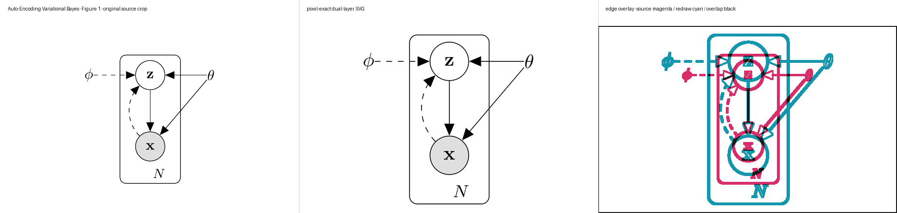</a>

Kingma & Welling (2013), Figure 1 · [paper](https://arxiv.org/abs/1312.6114)

<a href="assets/paper-redraws/gan.svg">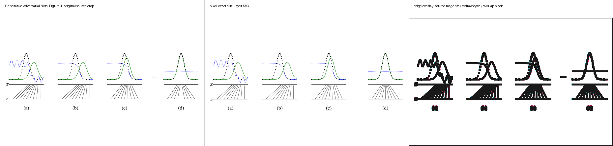</a>

Goodfellow et al. (2014), Figure 1 · [paper](https://arxiv.org/abs/1406.2661)

<a href="assets/paper-redraws/resnet-block.svg">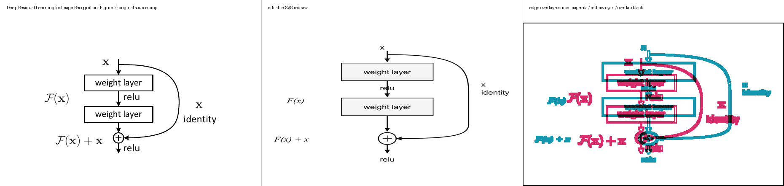</a>

He et al. (2015), Figure 2 · [paper](https://arxiv.org/abs/1512.03385)

<a href="assets/paper-redraws/unet.svg">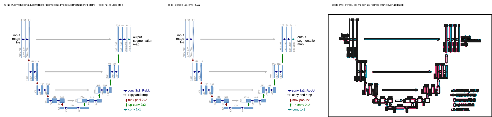</a>

Ronneberger et al. (2015), Figure 1 · [paper](https://arxiv.org/abs/1505.04597)

<a href="assets/paper-redraws/transformer.svg">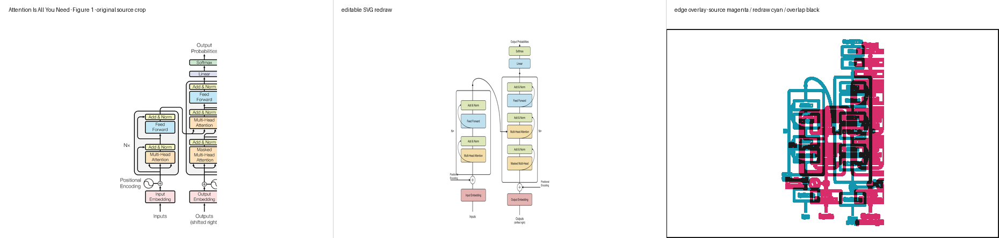</a>

Vaswani et al. (2017), Figure 1 · [paper](https://arxiv.org/abs/1706.03762)

<a href="assets/paper-redraws/neural-ode.svg">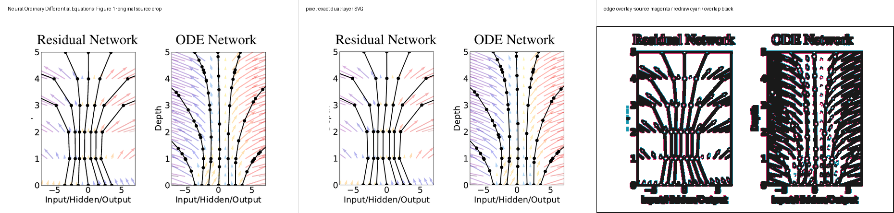</a>

Chen et al. (2018), Figure 1 · [paper](https://arxiv.org/abs/1806.07366)

<a href="assets/paper-redraws/simclr.svg">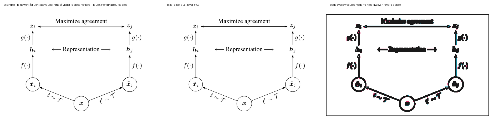</a>

Chen et al. (2020), Figure 2 · [paper](https://arxiv.org/abs/2002.05709)

<a href="assets/paper-redraws/ddpm.svg">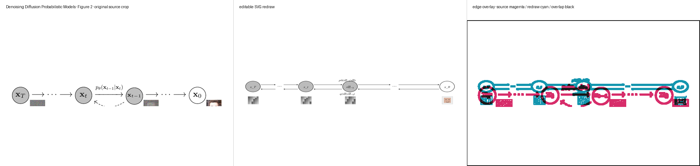</a>

Ho et al. (2020), Figure 2 · [paper](https://arxiv.org/abs/2006.11239)

<a href="assets/paper-redraws/vit.svg">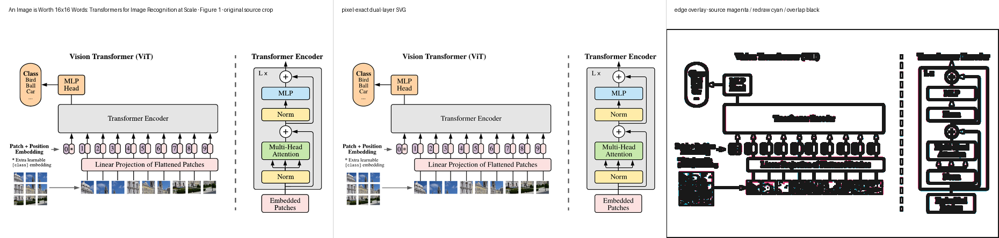</a>

Dosovitskiy et al. (2020), Figure 1 · [paper](https://arxiv.org/abs/2010.11929)

### Reproduce the paper SVGs and calibration plates

Generic assets remain dependency-free. Rebuilding a paper SVG requires Poppler (`pdftocairo` and `pdftoppm`), Pillow, Node.js, and Sharp:

```bash
python -m pip install Pillow
npm install --no-save sharp
python scripts/extract_pixel_exact_paper_figures.py
python scripts/calibrate_paper_figures.py
```

The extractor uses [`references/paper-figure-sources.json`](references/paper-figure-sources.json) for exact PDF URLs, pages, crop boxes, and rare operator-level trim overrides. It writes ignored working files under `tmp/pixel-exact-extraction/`, preserves the previous semantic reconstruction as the hidden editing layer, and regenerates the source-operator hashes. The calibration harness writes ignored work under `tmp/paper-calibration/`, then regenerates the committed plates and QA report. The loop and 35-SVG acceptance rules are documented in [`references/fidelity-protocol.md`](references/fidelity-protocol.md).

## Reproducible classic curves

The label printed in the top-right corner of every SVG states its fidelity:

- **FORMULA-DERIVED** — generated from a schedule or functional form described by the paper;
- **ILLUSTRATIVE NORMALIZED** — recreates the qualitative relationship with normalized synthetic values; it is not digitized experimental data.

<table>
<tr>
<td width="33%"><a href="assets/curves/double-descent.svg">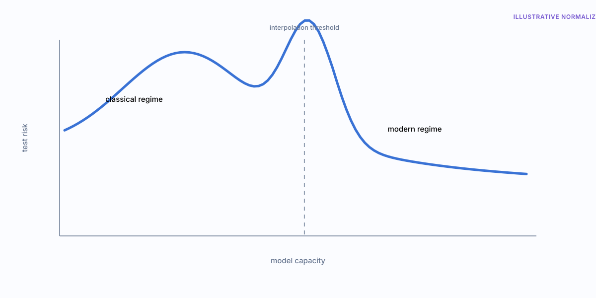</a><br><b>Double descent</b><br><sub>Illustrative normalized · <a href="https://arxiv.org/abs/1812.11118">Belkin et al. (2018)</a></sub></td>
<td width="33%"><a href="assets/curves/scaling-law.svg">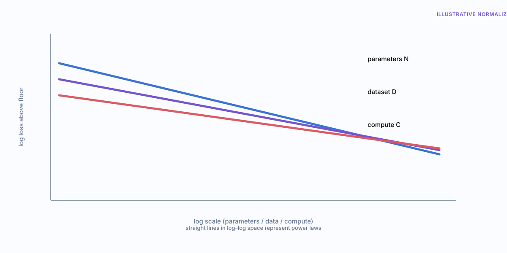</a><br><b>Neural scaling laws</b><br><sub>Illustrative normalized log–log trends · <a href="https://arxiv.org/abs/2001.08361">Kaplan et al. (2020)</a></sub></td>
<td width="33%"><a href="assets/curves/grokking.svg">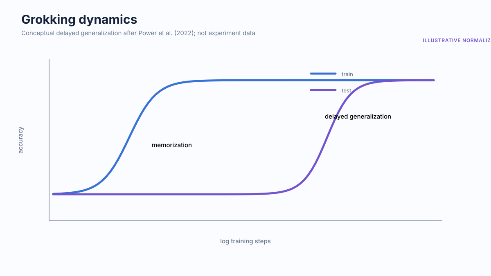</a><br><b>Grokking</b><br><sub>Illustrative normalized delayed generalization · <a href="https://arxiv.org/abs/2201.02177">Power et al. (2022)</a></sub></td>
</tr>
<tr>
<td><a href="assets/curves/cyclical-lr.svg">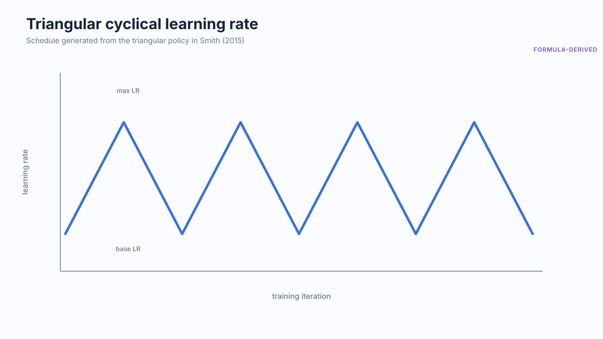</a><br><b>Cyclical learning rate</b><br><sub>Formula-derived triangular policy · <a href="https://arxiv.org/abs/1506.01186">Smith (2015)</a></sub></td>
<td><a href="assets/curves/cosine-restarts.svg">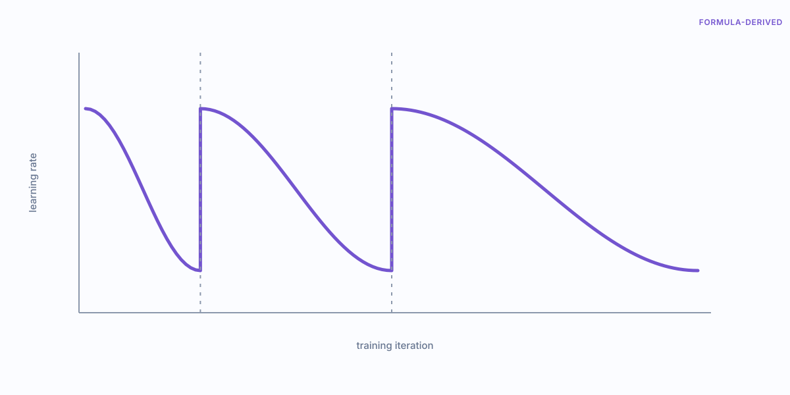</a><br><b>Cosine warm restarts</b><br><sub>Formula-derived SGDR schedule · <a href="https://arxiv.org/abs/1608.03983">Loshchilov & Hutter (2016)</a></sub></td>
<td><a href="assets/curves/diffusion-schedules.svg">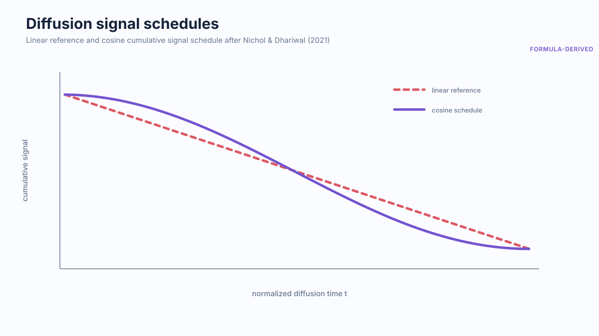</a><br><b>Diffusion schedules</b><br><sub>Formula-derived normalized cosine ᾱₜ · <a href="https://arxiv.org/abs/2102.09672">Nichol & Dhariwal (2021)</a></sub></td>
</tr>
</table>

### How the curves are reproduced

| Curve | Construction in `scripts/generate_gallery.py` | What it may claim |
|---|---|---|
| Double descent | Two smooth capacity-dependent peaks plus post-interpolation decay | The characteristic qualitative regimes only |
| Scaling laws | Normalized straight trends in log–log coordinates | A generic power-law relationship, not fitted exponents |
| Grokking | Two logistic transitions with delayed test generalization | The timing pattern, not a measured run |
| Cyclical LR | Periodic triangular interpolation between base and maximum learning rates | The defined triangular schedule |
| Cosine restarts | Cosine annealing over successively longer restart periods | The SGDR schedule form |
| Diffusion schedule | `cos²(((t+s)/(1+s))·π/2) / cos²((s/(1+s))·π/2)`, with `s = 0.008` | The normalized cosine cumulative signal schedule |

To reproduce all non-paper assets deterministically:

```bash
python scripts/generate_gallery.py
```

To discover IDs or regenerate one figure:

```bash
python scripts/generate_gallery.py --list
python scripts/extract_pixel_exact_paper_figures.py --only resnet-block
python scripts/generate_gallery.py --only diffusion-schedules
```

The generated output and its source/provenance record are in [`assets/gallery-manifest.json`](assets/gallery-manifest.json). The original six starter sheets predate the generator and are maintained directly as small editable SVG sources. The generator deterministically rebuilds 18 non-paper assets; the 11 paper assets are intentionally protected from that command and can only be replaced through the source-operator extraction pipeline.

### Reproducing a new paper figure or line

1. Read the original paper and identify the exact figure, equation, architecture, or experiment being represented.
2. Choose and disclose one fidelity class: `pixel-exact-dual-layer`, `faithful-redraw`, `semantic-redraw`, `formula-derived`, `data-recomputed`, or `illustrative-normalized`.
3. For `pixel-exact-dual-layer`, extract source PDF operators first, preserve their visible rendering, then add or retain the hidden semantic editing layer. For a manual faithful redraw, keep source, redraw, and edge overlay together and calibrate crop/aspect, topology/count, geometry, typography, appearance, then small detail.
4. For curves, prefer source data or an official implementation. If unavailable, use the stated formula. If only the trend is known, normalize it and label it illustrative.
5. Never present synthetic points as reported measurements. A digitized line must identify the original panel, axes, extraction method, and expected error.
6. Add the paper URL, exact figure number, fidelity, caveat, and one-command reproduction entry to the manifest.
7. Loop source crop → SVG render → tight pixel comparison → edge overlay until the validator passes: aspect error ≤1%, tolerant cross-renderer pixel match ≥80%, and hidden-layer isolation exactly 1.0.

## Start here

- [`SKILL.md`](SKILL.md) — operational authoring and reconstruction workflow
- [`assets/gallery-manifest.json`](assets/gallery-manifest.json) — generated asset provenance and commands
- [`assets/manifest.json`](assets/manifest.json) — original starter sheets and editable groups
- [`references/landscape.md`](references/landscape.md) — vector-model and scientific-figure survey
- [`references/catalog-latest.md`](references/catalog-latest.md) — latest curated repositories and discovered candidates
- [`references/figure-ir.md`](references/figure-ir.md) — semantic intermediate representation
- [`references/fidelity-protocol.md`](references/fidelity-protocol.md) — original/redraw/overlay calibration loop and 35-SVG acceptance rules
- [`references/output-contracts.md`](references/output-contracts.md) — SVG, draw.io, and PPTX editability rules

## Refresh and verify

```bash
python scripts/generate_gallery.py
python scripts/extract_pixel_exact_paper_figures.py
python scripts/calibrate_paper_figures.py
python scripts/sync_catalog.py
python scripts/validate_repo.py
python -m unittest discover -s tests -v
```

The scheduled workflow runs daily at 02:23 UTC. It refreshes repository metadata and star deltas, discovers candidates from bounded GitHub searches, validates the repository, and commits only the generated catalog snapshot. Discovered entries are leads, not endorsements; license and real editable-output behavior require human review before integration.

## Design and provenance rules

1. A bitmap embedded in SVG, PPTX, or draw.io is not by itself an editable figure. Exact paper reproduction may retain isolated source bitmap operators only when the manifest names and counts them.
2. Original figures keep text as text and connectors as connectors. Pixel-exact paper layers may outline glyphs; their semantic editing layer keeps named text and components.
3. Scientific meaning, exact labels, and topology outrank decorative polish.
4. Image models may supply visual ideas. The semantic scene is the source of truth for original work; the extracted source-operator layer is the pixel source of truth for exact reproduction.
5. External assets are opt-in and retain source and license metadata.
6. A semantic redraw is a teaching and authoring aid, not a substitute for citing or consulting the original paper.

Generator code and generic primitive sheets in this repository are MIT-licensed. Exact paper operator layers include explicit citations and retain the source papers' rights; check downstream reuse requirements for the intended venue. The repository does not relicense third-party paper artwork.
